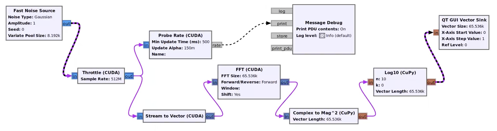

# gr-cuda

GPU-accelerated signal processing blocks for [GNU Radio](https://www.gnuradio.org/) 3.10+. Data moves to/from the GPU automatically; blocks receive device pointers directly in `work()`, no manual `cudaMemcpy` needed.



## Key features

- **Zero-copy GPU pipeline**: `cuda_buffer` handles host-device transfers and automatic CUDA-event synchronisation between blocks -- no sync boilerplate in `work()`. GPU kernels run back-to-back without round-tripping through the CPU.
- **Write GPU blocks in Python**: inherit from `cuda.sync_block`, get CuPy arrays in `work()`, done. Ten lines of Python for a new GPU block (see [example below](#pythoncupy-block)). Performance is within 5% of hand-written CUDA C++ (see [benchmarks](#performance)).
- **C++ GPU blocks**: `cuda_buffer` takes care of memory transfers, buffer management, synchronisation, and keeping the GPU fed; you just write the kernel (see [C++ block](#c-block)).
- **Virtual memory management**: `cuda_buffer` uses CUDA VMM to implement circular buffers on the device, mirroring the same trick GNU Radio uses on the CPU side.
- **Batteries included**: gr-cuda ships with building-block primitives to get you started (probe rate, GPU null source/sink, stream/vector operators, throttle, and more). All blocks include GRC definitions for drag-and-drop use.

## Quick start

### Prerequisites

- NVIDIA GPU with CUDA support
- [CUDA Toolkit](https://developer.nvidia.com/cuda-toolkit) >= 10.2
- GNU Radio >= 3.10 (>3.10.12 recommended; older versions have a [fan-out deadlock bug](https://github.com/gnuradio/gnuradio/pull/8029))
- CMake >= 3.18, Ninja (recommended)
- [CuPy](https://cupy.dev/) (for Python GPU blocks)

### Build and install

```bash
mkdir build && cd build
cmake .. -GNinja -DCMAKE_BUILD_TYPE=Release -Wno-dev
ninja && ninja install && ninja test
```

For conda environments, add `-DCMAKE_INSTALL_PREFIX="$CONDA_PREFIX" -DCMAKE_PREFIX_PATH="$CONDA_PREFIX"`.

> The build auto-detects your GPU architecture. To override: `-DCMAKE_CUDA_ARCHITECTURES=86`.

## Writing GPU blocks

### Python/CuPy block

Inherit from `cuda.sync_block` instead of `gr.sync_block`. Input/output items are CuPy arrays on the GPU -- use any `cp.*` operation:

```python
import cupy as cp
import numpy as np
from gnuradio import cuda

class my_cupy_block(cuda.sync_block):   # cuda.sync_block instead of gr.sync_block
    def __init__(self):
        cuda.sync_block.__init__(self, "my_cupy_block",
            [np.complex64], [np.complex64])

    def work(self, input_items, output_items):
        # input_items / output_items are CuPy arrays on the GPU
        cp.multiply(input_items[0], 2.0, out=output_items[0])
        return len(output_items[0])
```

`cuda.decim_block`, `cuda.interp_block`, and `cuda.basic_block` are also available. See [`multiply_const_cupy.py`](python/cuda/multiply_const_cupy.py) for a complete example.

For `general_work()` blocks (`cuda.basic_block`), enqueue all GPU work before calling `consume_each()` / `produce()`:

```python
class my_resampler(cuda.basic_block):
    def general_work(self, input_items, output_items):
        # ... GPU work with CuPy ...
        self.consume_each(n_consumed)
        self.produce(0, n_produced)
        return -2  # WORK_CALLED_PRODUCE
```

### C++ block

Inherit from `cuda_block` to get the managed `d_stream`. `work()` is just the kernel launch — `cuda_buffer` handles synchronisation between blocks:

```cpp
int my_block_impl::work(int noutput_items, ...)
{
    auto in  = static_cast<const float*>(input_items[0]);
    auto out = static_cast<float*>(output_items[0]);
    my_kernel<<<grid, block, 0, d_stream>>>(in, out, noutput_items);
    return noutput_items;
}
```

For `general_work()` blocks, enqueue all GPU work on `d_stream` **before** calling `consume_each()` / `produce()`:

```cpp
int my_block_impl::general_work(int noutput_items,
                                gr_vector_int& ninput_items,
                                gr_vector_const_void_star& input_items,
                                gr_vector_void_star& output_items)
{
    my_kernel<<<grid, block, 0, d_stream>>>(in, out, n_produced);

    consume_each(n_consumed);
    produce(0, n_produced);
    return WORK_CALLED_PRODUCE;
}
```

See [`cuda_block.h`](include/gnuradio/cuda/cuda_block.h) and [`multiply_const_impl.cc`](lib/multiply_const_impl.cc) for a full example.

> **Important.** In C++ blocks, pass `d_stream` to every kernel launch and every CUDA / library API call. In Python blocks, sticking to CuPy inside `work()` / `general_work()` works out of the box. See **[docs/LIMITATIONS.md](docs/LIMITATIONS.md)** for the full stream contract and guidance on mixing in other GPU libraries.

> Want to use gr-cuda blocks in your own out-of-tree module? See **[docs/OOT_INTEGRATION.md](docs/OOT_INTEGRATION.md)**.

## Zero-copy NIC <-> GPU I/O

When `libibverbs` is available at configure time, `gr-cuda` also builds two blocks for moving raw Ethernet frames between a NIC and GPU memory with no CPU involvement on the data path:

- **`cuda.ibv_source`** — receive raw UDP frames into a GPU-resident landing buffer via GPUDirect RDMA, with NIC hardware flow steering on UDP destination port (and optional IP multicast).
- **`cuda.ibv_sink`** — transmit GPU-resident payloads as raw UDP frames; L2/L3/L4 headers are constructed on the GPU and the NIC reads frames directly from GPU memory.

The build auto-detects `libibverbs`: if it isn't present, the IBV blocks are silently skipped and the rest of `gr-cuda` builds normally. To explicitly toggle, pass `-DENABLE_IBV=ON` or `-DENABLE_IBV=OFF` at configure time.

### Verifying your IBV link

Before debugging issues in a higher-level flowgraph that uses these blocks, validate the link itself with the bundled diagnostic.

```bash
# Single-host loopback (uses NIC-internal loopback):
sudo ibv_link_check.py --mode both \
    --tx-ibv-dev mlx5_0 --rx-ibv-dev mlx5_0 \
    --tx-dst-mac aa:bb:cc:dd:ee:ff \
    --duration 10

# Two-machine test:
# On the receiver:
sudo ibv_link_check.py --mode rx --rx-ibv-dev mlx5_0 ...
# On the sender (--tx-dst-mac is the receiver's NIC MAC):
sudo ibv_link_check.py --mode tx --tx-ibv-dev mlx5_0 \
    --tx-dst-mac aa:bb:cc:dd:ee:ff ...
```

## Performance

Benchmarked on an **NVIDIA DGX Spark (GB10)** and an **NVIDIA RTX PRO 6000 Blackwell** (PCIe 5.0 x16).

| Benchmark | GB10 | RTX PRO 6000 |
|-----------|-----:|-------------:|
| H2D transfer | 58.3 GB/s | 54.1 GB/s |
| D2H transfer | 59.1 GB/s | 56.4 GB/s |
| Full round-trip | 29.2 GB/s | 38.7 GB/s |
| cuFFT C64→C64 (C++) | 13.9 Gsps | 92.8 Gsps |
| CuPy FFT C64→C64 (Python) | 13.5 Gsps | 88.3 Gsps |
| FFTW C64→C64 (CPU baseline) | 0.45 Gsps | 1.01 Gsps |

CuPy blocks track within 5% of C++ CUDA blocks -- write your GPU blocks in Python with no meaningful performance penalty.

See **[docs/PERFORMANCE.md](docs/PERFORMANCE.md)** for more details, **[docs/OPTIMIZATIONS.md](docs/OPTIMIZATIONS.md)** for tuning guidance, and **[docs/LIMITATIONS.md](docs/LIMITATIONS.md)** for known limitations.

## Continuous integration

Lint runs on every push. The GPU test suite runs on pull requests from this
repository and on merges to `cascade/main` and `cascade/main-gr-3.10.13`; pull
requests from a fork need the `run-gpu-qa` label. See
**[docs/CI.md](docs/CI.md)**.

## Acknowledgements

This OOT is adapted from [gr-cuda_buffer](https://github.com/BlackLynx-Inc/gr-cuda_buffer) by Black Lynx, Inc. and relies on the custom buffer feature developed by David Sorber ([Custom Buffers wiki](https://wiki.gnuradio.org/index.php/CustomBuffers)). Further developed by Josh Morman and heavily modified and extended by Wael Farah & Brett Gottula at Cascade Space.

## License

GPL-3.0-or-later. See individual file headers for copyright details.
